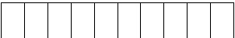
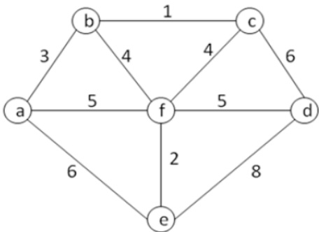
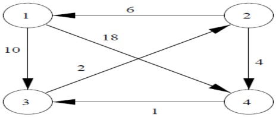
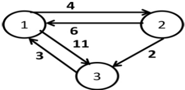

---
## PAGE 1
---

# VARDHAMAN COLLEGE OF ENGINEERING

(AUTONOMOUS)

II B.Tech II Semester Regular Examinations, July - 2024

(Regulations: VCE-R22)

DESIGN AND ANALYSIS OF ALGORITHMS

(Model Paper)

(CSE/CSE(AIML)/ AIML /IT)

Date: XX July 2024

Time: 3 Hours

Maximum Marks: 60

Answer all questions at one place only.

Course Outcomes with Bloom’s Levels:

<table border=1 style='margin: auto; width: max-content;'><tr><td style='text-align: center;'>CO#</td><td style='text-align: center;'>CO Statement</td><td style='text-align: center;'>Bloom&#x27;s Level (L#)</td></tr><tr><td style='text-align: center;'>CO1</td><td style='text-align: center;'>Make use of asymptotic notations, divide and conquer techniques to decompose complex problems into small and simple.</td><td style='text-align: center;'>L3</td></tr><tr><td style='text-align: center;'>CO2</td><td style='text-align: center;'>Choose Greedy method to find out feasible solutions of problems.</td><td style='text-align: center;'>L3</td></tr><tr><td style='text-align: center;'>CO3</td><td style='text-align: center;'>Examine complex engineering problems in finding the optimal solution.</td><td style='text-align: center;'>L4</td></tr><tr><td style='text-align: center;'>CO4</td><td style='text-align: center;'>Construct all possible solutions using backtracking methods.</td><td style='text-align: center;'>L3</td></tr><tr><td style='text-align: center;'>CO5</td><td style='text-align: center;'>Inspect Branch and Bound techniques and NP complete problems significance in algorithms.</td><td style='text-align: center;'>L4</td></tr></table>

Questions:

<table border=1 style='margin: auto; width: max-content;'><tr><td colspan="6">PART-A (Short Answer Type Questions)</td></tr><tr><td colspan="3"></td><td style='text-align: center;'>CO#</td><td style='text-align: center;'>BL#</td><td style='text-align: center;'>Marks</td></tr><tr><td rowspan="10">1.</td><td style='text-align: center;'>a)</td><td style='text-align: center;'>What are the characteristics of an algorithm.</td><td style='text-align: center;'>CO1</td><td style='text-align: center;'>BL1</td><td style='text-align: center;'>1 M</td></tr><tr><td style='text-align: center;'>b)</td><td style='text-align: center;'>Determine the descending order for the following functionsO(n!), O(n), O(n³), O(1), O(nlogn), O(logn)</td><td style='text-align: center;'>CO1</td><td style='text-align: center;'>BL2</td><td style='text-align: center;'>1 M</td></tr><tr><td style='text-align: center;'>c)</td><td style='text-align: center;'>Describe minimum cost spanning tree</td><td style='text-align: center;'>CO2</td><td style='text-align: center;'>BL2</td><td style='text-align: center;'>1 M</td></tr><tr><td style='text-align: center;'>d)</td><td style='text-align: center;'>What is the objective of knapsack problem?</td><td style='text-align: center;'>CO2</td><td style='text-align: center;'>BL1</td><td style='text-align: center;'>1 M</td></tr><tr><td style='text-align: center;'>e)</td><td style='text-align: center;'>Which algorithm is used for all pair shortest path problem?</td><td style='text-align: center;'>CO3</td><td style='text-align: center;'>BL1</td><td style='text-align: center;'>1 M</td></tr><tr><td style='text-align: center;'>f)</td><td style='text-align: center;'>List the applications of dynamic programming.</td><td style='text-align: center;'>CO3</td><td style='text-align: center;'>BL1</td><td style='text-align: center;'>1 M</td></tr><tr><td style='text-align: center;'>g)</td><td style='text-align: center;'>Describe N-Queen&#x27;s problem</td><td style='text-align: center;'>CO4</td><td style='text-align: center;'>BL2</td><td style='text-align: center;'>1 M</td></tr><tr><td style='text-align: center;'>h)</td><td style='text-align: center;'>State the sum of subsets problem.</td><td style='text-align: center;'>CO4</td><td style='text-align: center;'>BL1</td><td style='text-align: center;'>1 M</td></tr><tr><td style='text-align: center;'>i)</td><td style='text-align: center;'>What are the applications of branch and bound approach.</td><td style='text-align: center;'>CO5</td><td style='text-align: center;'>BL1</td><td style='text-align: center;'>1 M</td></tr><tr><td style='text-align: center;'>j)</td><td style='text-align: center;'>Draw the relationship between P, NP, NP-Hard and NP-Complete.</td><td style='text-align: center;'>CO5</td><td style='text-align: center;'>BL1</td><td style='text-align: center;'>1 M</td></tr><tr><td colspan="6">PART-B (Descriptive Questions)</td></tr><tr><td rowspan="5">2.</td><td style='text-align: center;'>a)</td><td style='text-align: center;'>Explain the Quick sort algorithm</td><td style='text-align: center;'>CO1</td><td style='text-align: center;'>BL2</td><td style='text-align: center;'>5 M</td></tr><tr><td style='text-align: center;'>b)</td><td style='text-align: center;'>Discuss briefly about various asymptotic notations with examples.</td><td style='text-align: center;'>CO1</td><td style='text-align: center;'>BL3</td><td style='text-align: center;'>5 M</td></tr><tr><td colspan="5">(OR)</td></tr><tr><td style='text-align: center;'>c)</td><td style='text-align: center;'>How Strassen&#x27;s reduced the time complexity compared to traditional matrix multiplication.</td><td style='text-align: center;'>CO1</td><td style='text-align: center;'>BL3</td><td style='text-align: center;'>5 M</td></tr><tr><td style='text-align: center;'>d)</td><td style='text-align: center;'>Sort the following elements in the ascending order, by applying merge sort algorithm. 12,13,18,15,14,17,16,19,11.</td><td style='text-align: center;'>CO1</td><td style='text-align: center;'>BL3</td><td style='text-align: center;'>5 M</td></tr><tr><td colspan="6"></td></tr><tr><td style='text-align: center;'>3.</td><td style='text-align: center;'>a)</td><td style='text-align: center;'>Solve the following knapsack problem where M=40 and N=4 using greedy technique. Weights [W1, W2, W3, W4] = [20, 25, 10, 15] Profits</td><td style='text-align: center;'>CO2</td><td style='text-align: center;'>BL3</td><td style='text-align: center;'>5 M</td></tr></table>

---
## PAGE 2
---

<table border=1 style='margin: auto; width: max-content;'><tr><td rowspan="8"></td><td style='text-align: center;'></td><td style='text-align: center;'>[P1, P2, P3, P4] = [20, 40, 35, 45]</td><td style='text-align: center;'></td><td style='text-align: center;'></td><td style='text-align: center;'></td></tr><tr><td rowspan="3">b)</td><td style='text-align: center;'>Write the pseudo code for Kruskal&#x27;s algorithm. Solve the following graph for its minimum spanning tree.</td><td style='text-align: center;'>CO2</td><td style='text-align: center;'>BL3</td><td style='text-align: center;'>5 M</td></tr><tr><td style='text-align: center;'></td><td style='text-align: center;'></td><td style='text-align: center;'></td><td style='text-align: center;'></td></tr><tr><td style='text-align: center;'>Fig.1</td><td style='text-align: center;'></td><td style='text-align: center;'></td><td style='text-align: center;'></td></tr><tr><td colspan="5">(OR)</td></tr><tr><td style='text-align: center;'>c)</td><td style='text-align: center;'>Apply Greedy method to find an optimal solution generated by Job Sequencing when n=7, (P1,P2...P7) = (20,15,10,7,5,3,10) and (D1,D2...D7)=(3,1,1,3,1,3,2).</td><td style='text-align: center;'>CO2</td><td style='text-align: center;'>BL3</td><td style='text-align: center;'>5 M</td></tr><tr><td rowspan="2">d)</td><td style='text-align: center;'>Using Dijkstra&#x27;s algorithm find single source shortest path for the following weighted graph</td><td style='text-align: center;'>CO2</td><td style='text-align: center;'>BL3</td><td style='text-align: center;'>5 M</td></tr><tr><td style='text-align: center;'></td><td style='text-align: center;'></td><td style='text-align: center;'></td><td style='text-align: center;'></td></tr><tr><td colspan="6"></td></tr><tr><td rowspan="5">4.</td><td rowspan="2">a)</td><td style='text-align: center;'>State the Objective of all pairs shortest path and provide the solution of all pairs shortest paths for the following.</td><td style='text-align: center;'>CO3</td><td style='text-align: center;'>BL4</td><td style='text-align: center;'>5 M</td></tr><tr><td style='text-align: center;'></td><td style='text-align: center;'></td><td style='text-align: center;'></td><td style='text-align: center;'></td></tr><tr><td style='text-align: center;'>b)</td><td style='text-align: center;'>Construct OBST for n=3, identifiers (a1, a2, a3)=(do, if, while), probabilities p(1:3)=(3,3,1) and q(0:3)=(2,3,1,1).</td><td style='text-align: center;'>CO3</td><td style='text-align: center;'>BL4</td><td style='text-align: center;'>5 M</td></tr><tr><td colspan="5">(OR)</td></tr><tr><td style='text-align: center;'>c)</td><td style='text-align: center;'>Using Dynamic Programming, find the fully parenthesized matrix product for multiplying the chain of matrices &lt; A1 A2 A3 A4 A5 &gt; whose dimensions are &lt;30X35&gt;, &lt;35X15&gt;, &lt;15X5&gt;, &lt;5X10&gt; and &lt;10X20&gt; respectively.</td><td style='text-align: center;'>CO3</td><td style='text-align: center;'>BL3</td><td style='text-align: center;'>10 M</td></tr></table>

---
## PAGE 3
---

<table border=1 style='margin: auto; width: max-content;'><tr><td colspan="8"></td></tr><tr><td rowspan="5">5.</td><td style='text-align: center;'>a)</td><td colspan="3">Draw and explain the tree organization of the 4-queen solution space?</td><td style='text-align: center;'>CO4</td><td style='text-align: center;'>BL2</td><td style='text-align: center;'>5M</td></tr><tr><td style='text-align: center;'>b)</td><td colspan="3">Apply backtracking to solve the following instance of the subset-sum problem: S={3, 5, 6, 7} and d=15</td><td style='text-align: center;'>CO4</td><td style='text-align: center;'>BL3</td><td style='text-align: center;'>5M</td></tr><tr><td colspan="7">(OR)</td></tr><tr><td style='text-align: center;'>c)</td><td colspan="3">Write an algorithm to find Hamiltonian Cycles in given graph.</td><td style='text-align: center;'>CO4</td><td style='text-align: center;'>BL3</td><td style='text-align: center;'>5M</td></tr><tr><td style='text-align: center;'>d)</td><td colspan="3">Construct knapsack instance for the following data n=3, m=21, P=(25,24,18) and W=(18,15,10) using backtracking?</td><td style='text-align: center;'>CO4</td><td style='text-align: center;'>BL3</td><td style='text-align: center;'>5M</td></tr><tr><td colspan="8"></td></tr><tr><td rowspan="6">6.</td><td rowspan="6">a)</td><td colspan="3">Apply branch and bound algorithm to solve the travelling sales person problem for the graph with a cost adjacency matrix as follows.</td><td style='text-align: center;'>CO5</td><td style='text-align: center;'>BL3</td><td style='text-align: center;'>10M</td></tr><tr><td colspan="3">$ \infty $  20 30 10 11</td><td style='text-align: center;'></td><td style='text-align: center;'></td><td style='text-align: center;'></td></tr><tr><td colspan="3">15 ∞ 16 4 2</td><td style='text-align: center;'></td><td style='text-align: center;'></td><td style='text-align: center;'></td></tr><tr><td colspan="3">3 5 ∞ 2 4</td><td style='text-align: center;'></td><td style='text-align: center;'></td><td style='text-align: center;'></td></tr><tr><td colspan="3">19 6 18 ∞ 3</td><td style='text-align: center;'></td><td style='text-align: center;'></td><td style='text-align: center;'></td></tr><tr><td colspan="3">16 4 7 16 ∞</td><td style='text-align: center;'></td><td style='text-align: center;'></td><td style='text-align: center;'></td></tr><tr><td style='text-align: center;'></td><td colspan="7">(OR)</td></tr><tr><td rowspan="6">b)</td><td rowspan="6">b)</td><td colspan="3">Solve the following instance of the knapsack problem using the branch and bound technique for W-15.</td><td style='text-align: center;'>CO5</td><td style='text-align: center;'>BL3</td><td style='text-align: center;'>5M</td></tr><tr><td style='text-align: center;'>i</td><td style='text-align: center;'>Pi</td><td style='text-align: center;'>wi</td><td style='text-align: center;'></td><td style='text-align: center;'></td><td style='text-align: center;'></td></tr><tr><td style='text-align: center;'>1</td><td style='text-align: center;'>10</td><td style='text-align: center;'>2</td><td style='text-align: center;'></td><td style='text-align: center;'></td><td style='text-align: center;'></td></tr><tr><td style='text-align: center;'>2</td><td style='text-align: center;'>10</td><td style='text-align: center;'>4</td><td style='text-align: center;'></td><td style='text-align: center;'></td><td style='text-align: center;'></td></tr><tr><td style='text-align: center;'>3</td><td style='text-align: center;'>12</td><td style='text-align: center;'>6</td><td style='text-align: center;'></td><td style='text-align: center;'></td><td style='text-align: center;'></td></tr><tr><td style='text-align: center;'>4</td><td style='text-align: center;'>18</td><td style='text-align: center;'>9</td><td style='text-align: center;'></td><td style='text-align: center;'></td><td style='text-align: center;'></td></tr><tr><td style='text-align: center;'>c)</td><td style='text-align: center;'>c)</td><td colspan="3">Identify a Non-deterministic algorithm for searching and sorting?</td><td style='text-align: center;'>CO5</td><td style='text-align: center;'>BL2</td><td style='text-align: center;'>5M</td></tr></table>
